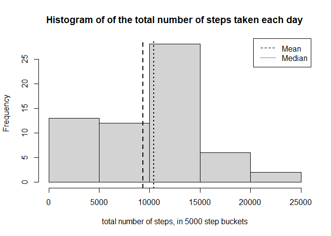
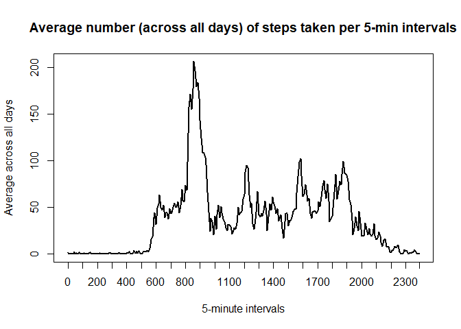
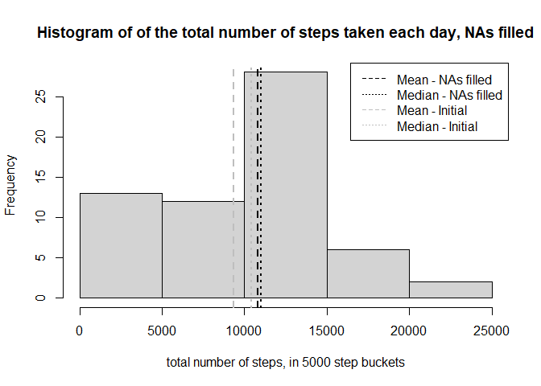
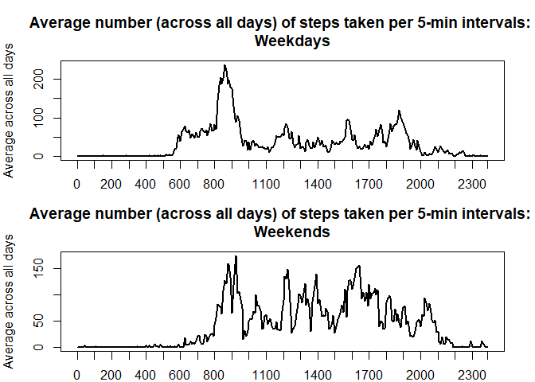

## What's the story?

The below analysis illustrates certain intra-day and intra-week patterns in number of steps per day, measured using a personal activity monitoring device. This device collects data at 5 minute intervals through out the day. The data consists of two months of data from an anonymous individual collected during the months of October and November, 2012 and include the number of steps taken in 5 minute intervals each day.

## Loading and preprocessing the data

First, data is loaded, and date records are transformed  into a format suitable for the analysis. Unzipping is only done at first iteration, the code line being subsequently commented out.NAs in the data are preserved at this stage.


```r
## unzip(zipfile="./activity.zip",exdir="./data")
activity <- read.csv("./data/activity.csv")
activity$date <- as.Date(activity$date,format="%Y-%m-%d")
```

## What is mean total number of steps taken per day?

The below code performs some basic calculations and plotting to:  

- Calculate the total number of steps taken per day,
- Make a histogram of the total number of steps taken each day,  
- Calculate the mean and median of the total number of steps taken per day, shown as vertical lines on the histogram.


```r
steptotal <- with(activity, tapply(steps,date,sum,na.rm=TRUE))
hist(steptotal, main="Histogram of of the total number of steps taken each day",
     xlab="total number of steps, in 5000 step buckets")
abline(v=mean(steptotal),lwd=2,col=1,lty=2)
abline(v=median(steptotal),lwd=2,col=1,lty=3)
legend(x="topright",lty=c(2,3),legend=c("Mean", "Median"))
```

<!-- -->

## What is the average daily activity pattern?

The below plot shows a time series of the 5-minute interval (x-axis) and the average number of steps taken, averaged across all days (y-axis).


```r
stepmeanbyinterval <- with(activity, tapply(steps,interval,mean,na.rm=TRUE))
myseq <- c(seq(1,dim(stepmeanbyinterval)[1],by=12),dim(stepmeanbyinterval)[1])
plot(stepmeanbyinterval, type='l',lwd=2, xaxt="n", xlab="5-minute intervals", ylab="Average across all days",
     main="Average number (across all days) of steps taken per 5-min intervals")
axis(1,at=myseq,labels(stepmeanbyinterval)[[1]][myseq])
```

<!-- -->

```r
maxstepinterval <- labels(stepmeanbyinterval[match(max(stepmeanbyinterval),stepmeanbyinterval)])
```

On average, across all days in the dataset, interval 835 contains the maximum number of steps.

## Imputing missing values

The presence of missing values may introduce bias into some calculations or summaries of the data. In the dataset, number of steps for some days/ intervals are missing.


```r
howmanyNAs <- length(activity[is.na(activity$steps)==TRUE,1])
```

In fact, there are 2304 of days/ intervals where there are missing values.

A simple method for filling in the missing values in the dataset, is to use the mean value. In this case, mean values for the respective interval (intra-day) and weekday (intra-week) will be used. This method assumes that the fact of missingness (represented by NA) is statistically independent of the actual value of the variable. The mean represents a point estimate based on a known (empirical) distribution of number of steps across intervals and weekdays. 

First, the variable "weekday" is added to the set, to denote the day of the week. Then, the mean for each interval and weekday combination is calculated:


```r
activity$weekday <- weekdays(activity$date)
stepmeanbyintervalweekday <- with(activity, tapply(steps,list(interval,weekday),mean,na.rm=TRUE))
```

Next, a new dataset is created that is equal to the original dataset but with the missing data filled in, in a way as described above:


```r
activityNAfilled <- activity
for (i in 1:length(activityNAfilled$steps)) {
  if (is.na(activityNAfilled$steps[i])==TRUE) 
    activityNAfilled$steps[i] <- stepmeanbyintervalweekday[match(activityNAfilled$interval[i],rownames(stepmeanbyintervalweekday)),
                                                           match(activityNAfilled$weekday[i],colnames(stepmeanbyintervalweekday))]
}
```

The below code performs some more calculations and plotting to:

- Calculate the total number of steps taken per day, for the new dataset (with NAs filled),
- Make a new histogram of the total number of steps taken each day, for the new dataset,
- Calculate the mean and median of the total number of steps taken per day, for the new dataset, shown as vertical lines on the histogram,
- Earlier mean and median are added for reference.

Let's look at the impact of imputing missing data on the estimates of the total daily number of steps. While mean is a good point estimate, filling the data set in this way adds multiple mean values to the data set. As a result,the probability mass moves towards the middle of the distribution impacting - increasing, in this case - both the mean and the median.


```r
steptotalNAfilled <- with(activityNAfilled, tapply(steps,date,sum,na.rm=TRUE))
hist(steptotal, main="Histogram of of the total number of steps taken each day, NAs filled",
     xlab="total number of steps, in 5000 step buckets")
abline(v=mean(steptotalNAfilled),lwd=2,col=1,lty=2)
abline(v=median(steptotalNAfilled),lwd=2,col=1,lty=3)
abline(v=mean(steptotal),lwd=2,col="gray",lty=2)
abline(v=median(steptotal),lwd=2,col="gray",lty=3)
legend(x="topright",lty=c(2,3,2,3),col=c(1,1,"gray","gray"),
       legend=c("Mean - NAs filled","Median - NAs filled","Mean - Initial","Median - Initial"))
```

<!-- -->

## Are there differences in activity patterns between weekdays and weekends?

The dataset with the filled-in missing values is used for this part of the analysis.

First, a new factor variable in the dataset is created, with two levels: “weekday” and “weekend”, indicating whether a given date is a weekday or weekend day.


```r
activityNAfilled$daycat <- as.factor(ifelse(activityNAfilled$weekday %in% c("Saturday","Sunday"), "weekend", "weekday"))
```

The below code performs some more calculations and plotting to:

- Calculate the average number of steps taken, averaged across all weekday days or weekend days,
- Make a panel plot containing a time series plot of the 5-minute interval (x-axis), and the average number of steps taken, averaged across all weekday days or weekend days (y-axis).


```r
stepmeanbyintervalNAfilledweekday <- with(activityNAfilled[activityNAfilled$daycat=="weekday",], tapply(steps,interval,mean,na.rm=TRUE))
stepmeanbyintervalNAfilledweekend <- with(activityNAfilled[activityNAfilled$daycat=="weekend",], tapply(steps,interval,mean,na.rm=TRUE))

par(mfrow=c(2,1),mar=c(2,4,4,2))

plot(stepmeanbyintervalNAfilledweekday, type='l',lwd=2, xaxt="n", xlab="5-minute intervals", ylab="Average across all days",
     main="Average number (across all days) of steps taken per 5-min intervals: 
     Weekdays")
axis(1,at=myseq,labels(stepmeanbyinterval)[[1]][myseq])

plot(stepmeanbyintervalNAfilledweekend, type='l',lwd=2, xaxt="n", xlab="5-minute intervals", ylab="Average across all days",
     main="Average number (across all days) of steps taken per 5-min intervals: 
     Weekends")
axis(1,at=myseq,labels(stepmeanbyinterval)[[1]][myseq])
```

<!-- -->

The plot shows that on weekends, people walk more, especially during the day. On weekdays, they walk less - maybe they sit in the office or complete project assignments:)

